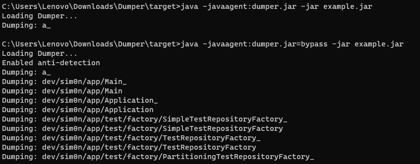
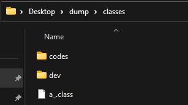
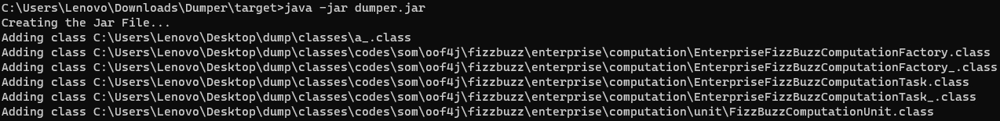

# 新增
- 支持通过 javaagent 参数设置需要 dump 的 calss 类前缀

使用方法如下

```
-javaagent:C:\EFaceGo\Tomcat8\webapps\manage\WEB-INF\lib\dumper.jar=com.hanvon;org.apache.tomcat.util.bcel.classfile.ClassParser;
```

这样只会dump jvm 里 `com.hanvon` 开头和 `org.apache.tomcat.util.bcel.classfile.ClassParser` 开头的class类，保存位置为 Java 的 temp 目录。


<hr>以下为原版介绍<hr>

# Dumper

> Extract the classes dynamically loaded in Java applications.

## Features

- Extracts classes loaded dynamically by a custom ClassLoader.
- Can be used to analyze obfuscated classes or classes protected by a packager.
- Offers an easy-to-use command-line interface.
- Generates output files in readable and processable formats (such as Java class files).
- Incorporates an anti-detection system, which involves modifying the `sun/management/RuntimeImpl` class at the ASM level to evade detection mechanisms.

## Usage

> 1. Add -javaagent:dumper.jar`=bypass` to arguments. Where `=bypass` is optional.</br>
</br>
> Note: I used `=bypass` argument, because the `a_` class contains the next code:
> ```java
> static {
>        List list = Arrays.asList("-javaagent", "-Xdebug", "-agentlib", "-Xrunjdwp", "-Xnoagent", "-verbose", "-DproxySet", "-DproxyHost", "-DproxyPort", "-Djavax.net.ssl.trustStore", "-Djavax.net.ssl.trustStorePassword", "-StartAttachListener", "-XBootclasspath");
>        boolean bl = false;
>        block0: for (String string : ManagementFactory.getRuntimeMXBean().getInputArguments()) {
>            for (String string2 : list) {
>                if (!string.startsWith(string2)) continue;
>                bl = true;
>                continue block0;
>            }
>        }
>        block2: for (String string : Arrays.asList(System.getenv("JAVA_TOOL_OPTIONS"), System.getenv("JAVA_OPTIONS"), System.getenv("JAVA_OPTS"))) {
>            if (string == null) continue;
>            for (String string2 : list) {
>                if (!string.contains(string2)) continue;
>                bl = true;
>                continue block2;
>            }
>        }
>        if (bl) {
>            Runtime.getRuntime().halt(1);
>            Error error = new Error();
>            error.setStackTrace(new StackTraceElement[0]);
>            throw error;
>        }
>    }


> 2. After dumping, you will have a folder in your desktop with the classes.</br>


> 3. You can convert the folder with classes into a .jar file using the Dumper as normal java application.</br>


## Showcase

